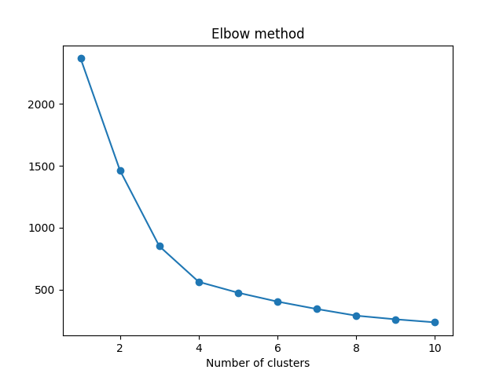

# Probabilistic Artificial Intelligence 2024 Tasks - ETH

## Task 1: Gaussian Process Regression

The purpose of the task was to predict the pollution level at different points in a 2D-space using Gaussian Processes.
For this task, we first decided to cluster points based on their location using K-Means. We used the elbow method to find the
good amount of clusters k to minimize WCSS. (Within-Cluster Sum of Squares). Once this was done, we train a Gaussian Process regressor for each cluster.
We used prior mean equal to 0 and decided to opt for the following kernel: C \* RBF + WhiteNoise in order to account for the noisy observations.

The cost function was computed such that for some points located in flagged areas, underprediction was highly penalized (50 times larger). To account for this, we had
to take into consideration the std of the distribution at some point in order to compute its prediction when it was flagged. The best hyperparameter for the factor in front of the standard deviation
was close to 1.
